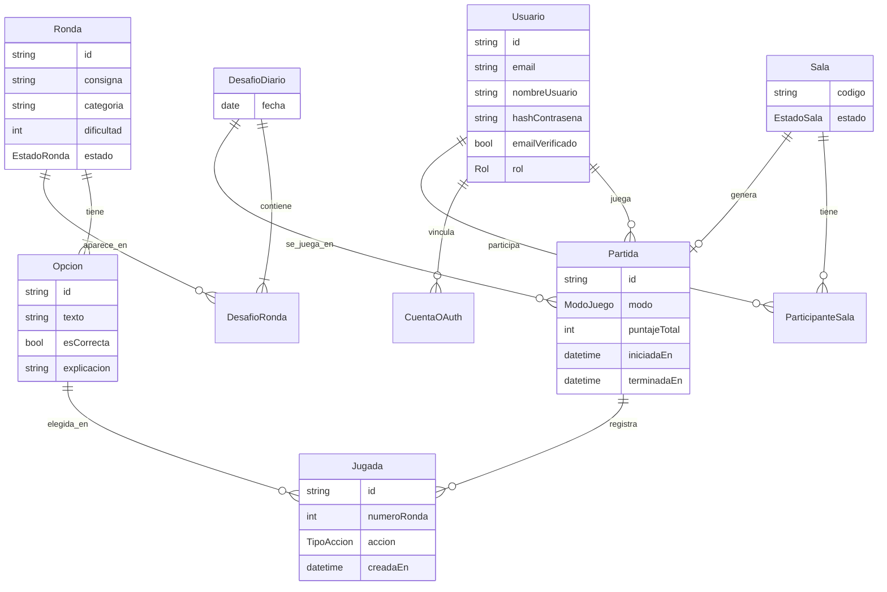

# Buscaminas de Programación — Arquitectura v0.1

> Complementa a `docs/SPEC.md`. La spec dice **qué** hace el sistema; este documento dice **cómo** está construido.
> Todo lo marcado como *provisional* se confirma o corrige al llegar al paso correspondiente de la hoja de ruta (sección 9), y el cambio se registra acá en el mismo commit.

---

## 1. Stack

| Capa | Tecnología | Motivo |
|---|---|---|
| Lenguaje | TypeScript (modo `strict`) en todo el proyecto | Un solo lenguaje, tipos compartidos entre front y back |
| Monorepo | pnpm workspaces | Paquetes internos sin publicar en npm |
| Motor del juego | TypeScript puro + Vitest | Sin dependencias de frameworks; se testea aislado |
| Backend | NestJS | Arquitectura modular, guards para auth/roles, soporte de WebSockets |
| Base de datos | PostgreSQL | Relacional; ranking y partidas son consultas con joins |
| ORM | Prisma | Consultas tipadas y migraciones versionadas |
| Tiempo real | Socket.IO vía `@nestjs/websockets` | Salas multijugador |
| Frontend | Next.js (App Router) + React | Visto en el curso; SEO para las páginas públicas |
| Tests backend | Jest (default de NestJS) + Supertest | Tests de endpoints |
| Contenedores | Docker + docker-compose | PostgreSQL local desde el paso 3 |
| CI | GitHub Actions | Lint + tests en cada push y PR |

Las versiones exactas se fijan al crear cada paquete, usando la última LTS/estable disponible en ese momento.

---

## 2. Estructura del monorepo

```
buscaminas/
├── CLAUDE.md                 ← instrucciones para el asistente local
├── docs/
│   ├── SPEC.md
│   └── ARQUITECTURA.md
├── packages/
│   └── motor/                ← lógica del juego + tipos compartidos
│       ├── src/
│       │   ├── tipos.ts      ← Ronda, Opcion, EstadoRonda, Accion...
│       │   ├── ronda.ts      ← reglas de la sección 3 de la spec
│       │   ├── jugador.ts    ← interfaz Jugador
│       │   └── bot/          ← EstrategiaBot y sus implementaciones
│       └── test/
├── apps/
│   ├── api/                  ← NestJS
│   └── web/                  ← Next.js
├── docker-compose.yml
├── pnpm-workspace.yaml
└── .github/workflows/ci.yml
```

**Regla de dependencias:** `api` y `web` pueden importar de `motor`. `motor` no importa de nadie. `web` nunca importa de `api` (se comunican solo por HTTP y WebSocket).

---

## 3. Paquete `motor`

- Contiene **toda** la lógica de reglas: elegir opción, plantarse, ronda perfecta, fin de ronda, turnos, eliminación.
- Funciones puras siempre que sea posible: reciben un estado y una acción, devuelven un estado nuevo (sin mutar el anterior).
- No sabe nada de HTTP, base de datos ni sockets.
- Exporta también los tipos que usa el frontend para no duplicarlos.
- **Tipos públicos vs privados:** `OpcionPublica` (sin `esCorrecta`) es lo único que viaja al cliente durante una ronda activa. Ver spec, sección 8.

---

## 4. Backend (`apps/api`) — módulos NestJS

| Módulo | Responsabilidad |
|---|---|
| `PrismaModule` | Conexión a la base de datos, compartida por todos |
| `AuthModule` | Registro, login email/contraseña, OAuth GitHub, emisión y refresco de tokens |
| `UsuariosModule` | Perfil, estadísticas |
| `RondasModule` | Banco de rondas (lectura para el juego, CRUD para admin) |
| `PartidasModule` | Modo Solo y Vs IA; usa `motor` |
| `DesafioDiarioModule` | Selección de las 10 rondas del día y cambio a las 00:00 de Argentina |
| `RankingModule` | Consultas de ranking diario e histórico |
| `SalasModule` | Gateway de Socket.IO, estado de salas, turnos, reconexión |
| `AdminModule` | Generación de rondas con LLM, aprobación |

**Capas dentro de cada módulo:** `controller` (HTTP) → `service` (reglas de negocio, llama a `motor`) → Prisma. Los controllers no contienen lógica.

---

## 5. Autenticación y autorización

- La autenticación vive **solo en el backend**. Next.js no maneja sesiones propias.
- **Access token:** JWT de vida corta (~15 min). Viaja en el header `Authorization: Bearer …` y en el `auth` del handshake de Socket.IO.
- **Refresh token:** vida larga, en cookie `httpOnly`, `Secure`, `SameSite=Lax`. Se guarda hasheado en la base para poder revocarlo.
- **Guards de NestJS:** `JwtAuthGuard` (¿está logueado?) y `RolesGuard` + decorador `@Roles('ADMIN')` (¿tiene permiso?). Sin rol suficiente → `403`.
- **OAuth GitHub:** con Passport (`passport-github2`). Vinculación de cuentas por email verificado (spec 6.1).
- **Admin:** script `pnpm --filter api seed:admin` que lee `ADMIN_EMAIL` (spec 6.4).

⚠️ **Nota para el deploy:** si el frontend y el backend quedan en dominios distintos (ej. `*.vercel.app` y `*.onrender.com`), el navegador trata la cookie del refresh token como de terceros y puede bloquearla. Solución prevista: un dominio propio con subdominios (`app.midominio.com` y `api.midominio.com`). Se confirma en el paso 9.

---

## 6. Desafío diario y zona horaria

- Zona horaria de negocio: `America/Argentina/Buenos_Aires`.
- La base guarda timestamps en UTC. La **fecha del desafío** se calcula convirtiendo "ahora" a hora de Argentina y tomando la fecha calendario.
- Nunca se usa `new Date().getDate()` directamente en el servidor: depende de la zona horaria de la máquina donde corre.
- Tabla `DesafioDiario` con `fecha` (tipo `DATE`, única) y sus 10 rondas en orden.

---

## 7. Modelo de datos (provisional)

Se refina en los pasos 3, 5, 6 y 8. Los nombres de campos definitivos quedan en `schema.prisma`.



Preguntas abiertas que se resuelven al implementar:
- ¿Una partida de sala es **una** `Partida` con varios participantes, o una `Partida` por jugador? (paso 8)
- ¿El estado en curso de una sala vive en memoria, en la base o en Redis? (paso 8)

---

## 8. Contrato de la API (provisional)

### REST
| Método | Ruta | Auth | Descripción |
|---|---|---|---|
| POST | `/auth/registro` | — | Crear cuenta (siempre rol `USER`) |
| POST | `/auth/login` | — | Login email/contraseña |
| GET | `/auth/github` | — | Iniciar OAuth |
| POST | `/auth/refresh` | cookie | Nuevo access token |
| POST | `/auth/logout` | ✔ | Revocar refresh token |
| GET | `/usuarios/:nombreUsuario` | — | Perfil público |
| POST | `/partidas` | ✔ | Iniciar partida (`modo`, `dificultad` si es Vs IA) |
| GET | `/partidas/:id/ronda-actual` | ✔ | Consigna + 16 `OpcionPublica` |
| POST | `/partidas/:id/jugadas` | ✔ | Elegir opción o plantarse |
| GET | `/ranking/diario` | — | Ranking del día |
| GET | `/ranking/historico` | — | Ranking histórico |
| POST | `/admin/rondas/generar` | ADMIN | Pedir borrador al LLM |
| PATCH | `/admin/rondas/:id` | ADMIN | Editar / aprobar |

### Socket.IO (paso 8)
Eventos previstos: `sala:unirse`, `sala:estado`, `sala:iniciar`, `turno:jugar`, `turno:resultado`, `turno:timeout`, `ronda:fin`, `partida:fin`, `jugador:desconectado`.

---

## 9. Hoja de ruta

Cada paso termina con un commit (o PR) y cumple su **criterio de terminado**.

| # | Paso | Criterio de terminado |
|---|---|---|
| 0 | Repo, monorepo, `CLAUDE.md`, docs | `pnpm install` funciona; docs commiteados |
| 1 | Motor: tipos y reglas del modo Solo | Tests Vitest de acierto, mina, plantarse, ronda perfecta y opción repetida en verde |
| 2 | Motor: turnos, eliminación y bots | Tests de las 3 dificultades con semilla aleatoria fija |
| 3 | API base + Prisma + Docker (Postgres) | Partida Solo jugable completa desde Postman |
| 4 | Frontend mínimo | Partida Solo jugable en el navegador |
| 5 | Auth (email + GitHub), roles, perfil | Guards probados: 401 sin login, 403 sin rol |
| 6 | Desafío diario + ranking | Cambio de día verificado con test que simula las 23:59 y 00:01 de Argentina |
| 7 | Vs IA en el frontend | Partida completa contra cada dificultad |
| 8 | Panel admin + LLM | Ronda generada, revisada y aprobada aparece en el banco |
| 9 | Salas con Socket.IO | 3 navegadores juegan una partida completa, con una desconexión y reconexión |
| 10 | CI/CD + deploy | Link público funcionando; README con capturas y decisiones técnicas |

---

## 10. Convenciones

- **Commits:** Conventional Commits (`feat:`, `fix:`, `test:`, `docs:`, `refactor:`, `chore:`).
- **Ramas:** `main` siempre funciona; una rama por paso (`paso-1-motor-solo`).
- **Idioma:** dominio del juego en español (`Ronda`, `Opcion`, `pozo`); términos técnicos estándar en inglés (`controller`, `service`, `guard`).
- **Variables de entorno:** nunca se commitean. Existe `.env.example` con todas las claves y sin valores reales.
